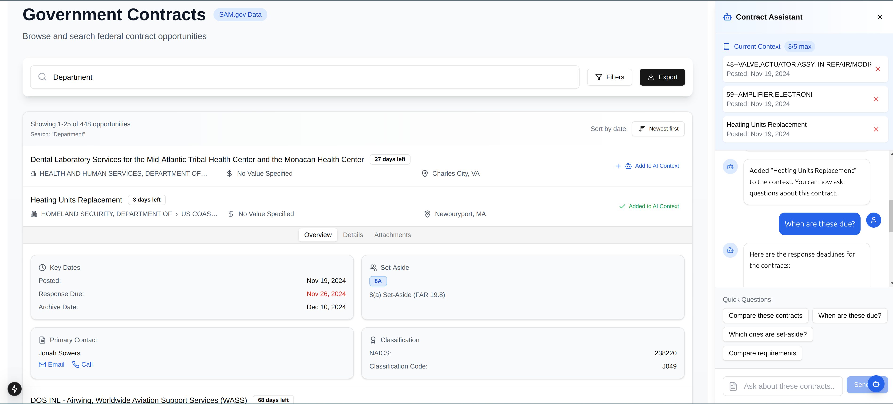

# Gov-Hub

Gov-Hub is a personal learning project focused on building a modern web application for exploring government contract data. It serves as a practical exploration of Next.js 15, Supabase, and TypeScript while providing an intuitive interface for accessing and filtering contract data from SAM.gov.

https://gov-hub.vercel.app/



## Project Goals

- Learn and implement Next.js 15 features and best practices
- Gain hands-on experience with Supabase as a backend solution
- Practice TypeScript in a real-world application
- Explore modern UI/UX patterns with Tailwind CSS and Shadcn/ui
- Understand government contracting data structures and relationships

## Features

- **Advanced Contract Search & Filtering**: Comprehensive search capabilities with advanced filtering options
  - Filter by contract type (Solicitation, Award Notice, etc.)
  - Filter by set-aside types using official SAM.gov codes
  - Filter by status (Active, Archived, Awarded)
  - Date range filtering
  - Award value range filtering
  - Advanced text search with support for keywords and phrases
  - Multi-select filtering for departments and agencies
  - NAICS code filtering with industry descriptions

- **Data Export Capabilities**:
  - Export filtered results to CSV format
  - Export to Excel (XLSX) with formatted data
  - Export to JSON for data integration
  - Customizable export fields
  - Single page and bulk export support

- **Contract Assistant AI Chatbot**:
  - Natural language interaction for contract queries
  - Intelligent contract analysis and insights
  - Context-aware responses based on contract details
  - Assistance with understanding contract requirements
  - Quick answers to common contracting questions

- **Contract Status Management**:
  - Active/Archived status based on contract state
  - Award status tracking
  - Clear status indicators
  - Document attachment support with secure download links

- **Set-Aside Support**:
  - Complete support for all SAM.gov set-aside codes
  - Human-readable labels for set-aside types
  - Multiple set-aside selection
  
## Tech Stack

- **Frontend**: 
  - Next.js 15
  - React
  - TypeScript
  - Tailwind CSS
  - Shadcn/ui components

- **Backend**:
  - Supabase (PostgreSQL)
  - Edge functions, Database functions and stored procedures
  - Papaparse for data export (CSV, XLSX)
  - Real-time updates
  - xAI's Grok-beta model for contract analysis

- **API & Integration**:
  - RESTful endpoints following OpenAPI standards
  - Secure document download capabilities
  - Real-time contract updates

- **Infrastructure & Deployment**:
  - Vercel for hosting and deployment
  - Serverless functions (API routes)
  - Edge runtime optimization
  - Automatic CI/CD pipeline

## Getting Started

1. **Prerequisites**:
   ```bash
   node >= 18.17.0
   npm >= 9.6.7
   ```

2. **Environment Setup**:
   Create a `.env.local` file with your Supabase credentials:
   ```
   NEXT_PUBLIC_SUPABASE_URL=your_supabase_url
   NEXT_PUBLIC_SUPABASE_ANON_KEY=your_supabase_anon_key
   ```

3. **Installation**:
   ```bash
   npm install
   ```

4. **Development**:
   ```bash
   npm run dev
   ```
   Open [http://localhost:3000](http://localhost:3000) to view the application.

## Database Schema

### Contracts Table
Primary table storing contract information:
- `id`: Primary key (BIGINT, auto-incrementing)
- `notice_id`: Unique contract identifier (TEXT)
- `title`: Contract title (TEXT)
- `department`, `sub_tier`, `office`: Organizational hierarchy fields
- `posted_date`: When the contract was posted (TIMESTAMP WITH TIME ZONE)
- `type`: Contract type
- `active`: Boolean flag for active/archived status
- `set_aside_code`: SAM.gov set-aside code
- `set_aside_description`: Human-readable set-aside description
- `response_deadline`: Deadline for responses (TIMESTAMP WITH TIME ZONE)
- `naics_code`: Industry classification code
- `award`: JSON object containing award details (JSONB)
- `search_vector`: Generated column for full-text search
- Metadata: `created_at`, `updated_at`, `last_sync_at`

### Contract Addresses
Normalized storage for address information:
- `id`: Primary key
- `contract_id`: Foreign key to contracts table
- `address_type`: 'office' or 'performance'
- Address fields: street, city, state, zip, country (with respective codes)

### Contract Contacts
Normalized storage for contact information:
- `id`: Primary key
- `contract_id`: Foreign key to contracts table
- `contact_type`: Type of contact
- Contact details: full name, title, email, phone, fax

### Optimizations
- B-tree indexes on commonly queried fields
- GIN index for full-text search
- Trigram index for fuzzy title search
- Automatic timestamp updates via triggers

## Future Work

The following features and improvements are planned for future development:

- **Additional Data Sources**:
  - Expand beyond SAM.gov to include other government contract databases
  - Integration with other federal procurement systems
  - Support for state and local government contract data

- **Authentication and Personalization**:
  - Implement Supabase authentication for user accounts
  - Personal dashboards with saved searches and filters
  - Custom alert settings for contract opportunities
  - Persistent user preferences and settings (Currently using session storage)

- **Enhanced AI Capabilities**:
  - Include document and attachment contents in AI context for deeper analysis
  - Improved contract summarization and comparison
  - Automated opportunity matching based on user profile
  - Advanced analytics and trend identification

## Learning Resources

This project draws inspiration and knowledge from:
- [Next.js 15 Documentation](https://nextjs.org/docs)
- [Supabase Documentation](https://supabase.com/docs)
- [SAM.gov API](https://sam.gov/data-services/) for understanding government contract data structures
- [Shadcn/ui](https://ui.shadcn.com/) for React component patterns
